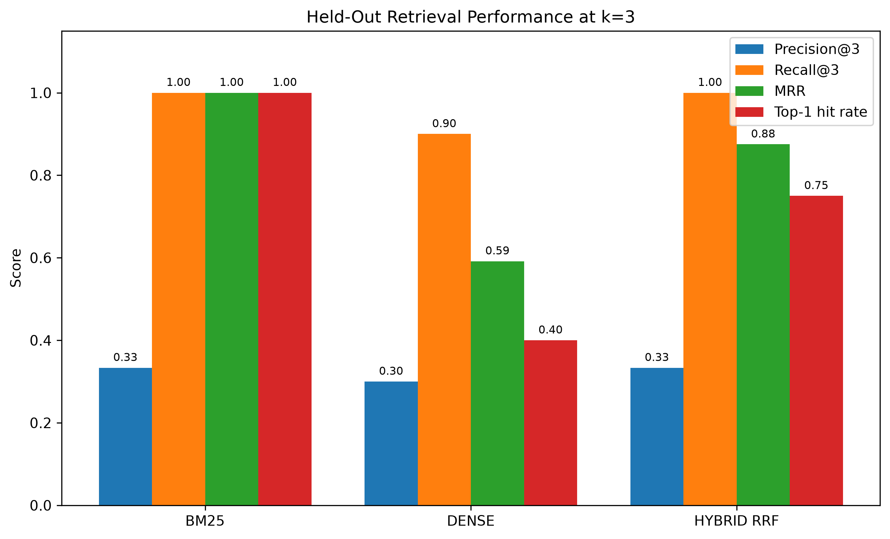
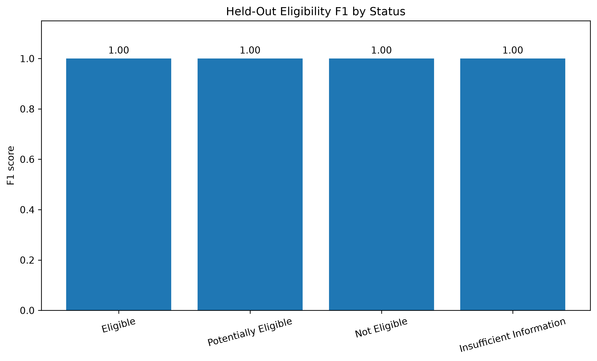
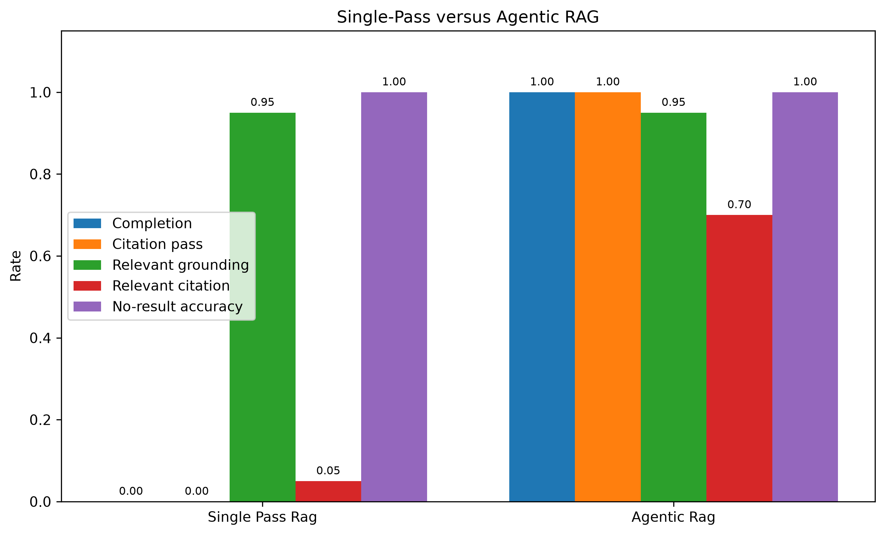
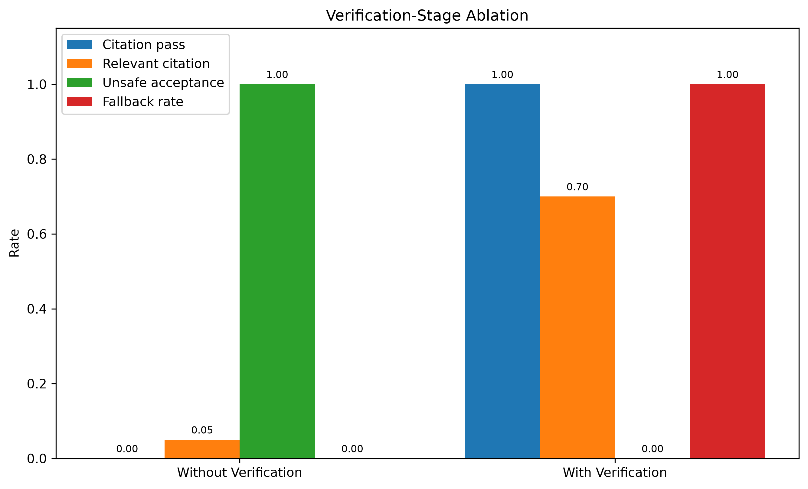
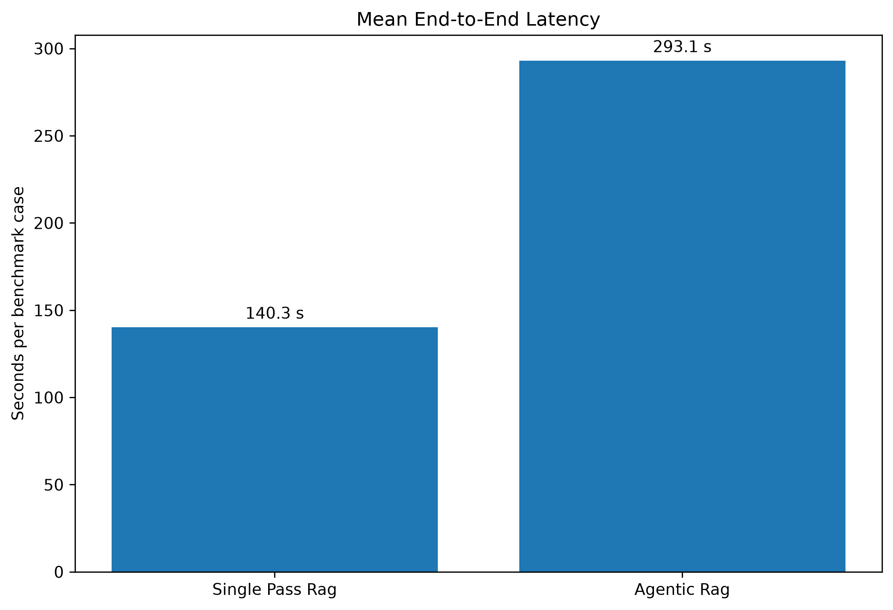
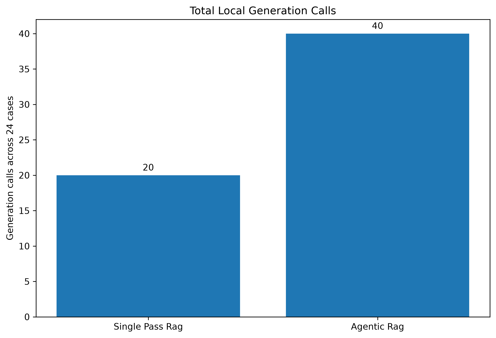
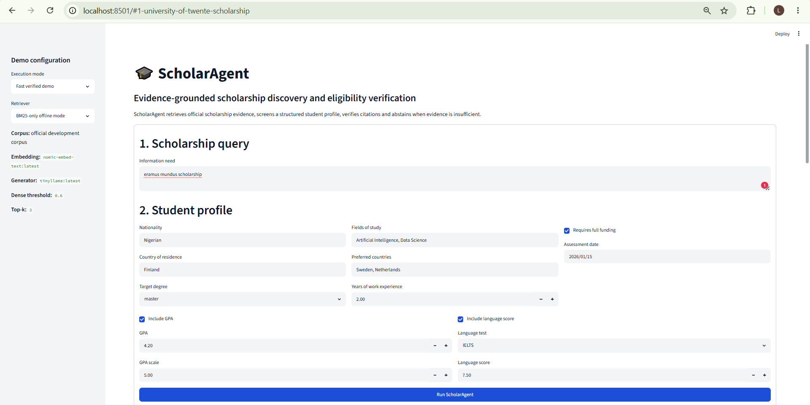
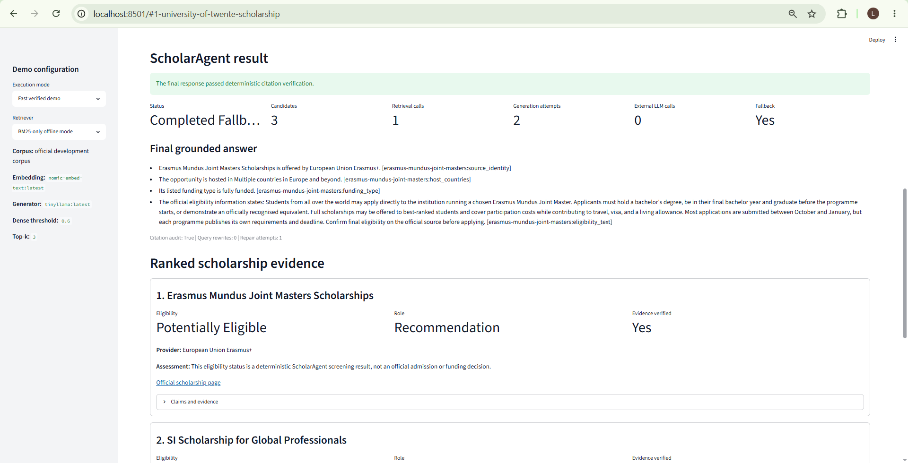
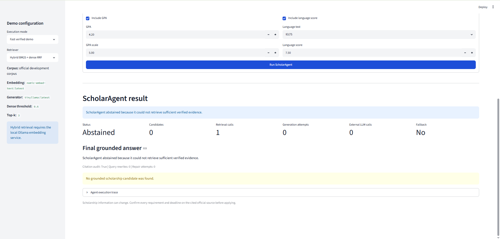

# ScholarAgent

## Evidence-Grounded Agentic RAG for Scholarship Discovery and Eligibility Verification

**Authors:** Tivdzua Lubem Noah and Gisele Wiykiynyuy
**Institution:** Innopolis University
**Project:** Agentic AI Course Project
**Evaluation date:** June 2026

---

## Abstract

ScholarAgent is an evidence-grounded Agentic Retrieval-Augmented Generation system for scholarship discovery and eligibility verification. It combines official-source scholarship records, BM25 and dense retrieval, hybrid Reciprocal Rank Fusion, deterministic eligibility screening, evidence construction, citation verification, bounded query rewriting, bounded answer repair, deterministic fallback, and safe abstention.

The system was evaluated using a frozen held-out corpus of six scholarship programmes and 24 benchmark cases. BM25 achieved perfect Recall@3, MRR, and Top-1 accuracy on this controlled corpus. The deterministic eligibility engine achieved perfect accuracy and macro F1 across four balanced eligibility classes. Single-pass RAG failed citation verification on all positive cases. The Agentic RAG workflow achieved citation-safe completion for all positive cases, but every successful completion required deterministic verified fallback rather than a successful TinyLlama repair.

These results show that bounded verification and deterministic recovery can substantially improve safety, although they introduce additional generation calls and approximately twice the runtime of single-pass RAG.

---

## 1. Introduction

Scholarship applicants must evaluate nationality, degree level, field of study, GPA, professional experience, language requirements, funding, application deadlines, and programme-specific conditions. Search engines may retrieve relevant pages but do not reliably determine applicant eligibility. Language models may produce fluent recommendations that are unsupported, outdated, or incorrectly cited.

ScholarAgent addresses this problem through a bounded agent workflow that retrieves official evidence, screens a structured applicant profile, verifies citations, and either returns a grounded result, applies deterministic fallback, or abstains safely.

The system is a screening assistant. Its outputs are not official admissions or scholarship decisions.

---

## 2. Objectives

The project objectives were to:

1. construct an official-source scholarship corpus with provenance;
2. compare BM25, dense, and hybrid retrieval;
3. implement explainable deterministic eligibility screening;
4. ground factual claims in source-linked evidence;
5. verify citation integrity before accepting generated answers;
6. implement bounded query rewriting and answer repair using LangGraph;
7. compare conventional single-pass RAG with Agentic RAG;
8. evaluate fallback, abstention, latency, and generation-call cost;
9. document representative execution traces;
10. provide a working Streamlit demonstration application.

---

## 3. Research Questions

**RQ1.** Which retrieval method performs best on the controlled official scholarship benchmark?

**RQ2.** Can deterministic rules accurately distinguish eligible, potentially eligible, not eligible, and insufficient-information cases?

**RQ3.** Does citation verification improve the safety and completion of RAG-generated scholarship answers?

**RQ4.** What runtime and generation-call overhead is introduced by the Agentic RAG workflow?

**RQ5.** Can the system fail safely when retrieval is unsupported, a scholarship has expired, or the local language model times out?

---

## 4. System Architecture

ScholarAgent uses the following processing pipeline:

```text
User query and structured applicant profile
                    |
                    v
              Query planning
                    |
                    v
       BM25 / Dense / Hybrid retrieval
                    |
                    v
      Deterministic eligibility screening
                    |
                    v
        Evidence and claim construction
                    |
                    v
           Evidence sufficiency grading
             |                 |
        sufficient         insufficient
             |                 |
             v                 v
        Generation        Query rewriting
             |
             v
        Citation audit
          |       |
        pass      fail
          |       |
          v       v
      Complete   Bounded repair
                     |
                     v
          Deterministic verified fallback
                     |
                     v
              Complete or abstain
```

The main implementation modules are:

| Component | Module |
|---|---|
| Retrieval and screening graph | `agents/scholar_graph.py` |
| Complete Agentic RAG graph | `agentic_rag.py` |
| Eligibility engine | `eligibility/engine.py` |
| BM25 retrieval | `retrieval/bm25.py` |
| Dense retrieval | `retrieval/dense.py` |
| Hybrid RRF retrieval | `retrieval/hybrid.py` |
| Grounding and citation verification | `grounding.py` |
| Single-pass baseline | `rag_baseline.py` |
| Evaluation framework | `evaluation/` |
| Streamlit interface | `ui/streamlit_app.py` |

The workflow limits retrieval attempts and generation attempts, preventing unbounded agent loops.

---

## 5. Retrieval Methods

### 5.1 BM25

BM25 provides a reproducible lexical-search baseline. Scholarship fields are normalized and tokenized before ranking. It is especially effective where queries contain distinctive university, programme, degree, and funding terms.

### 5.2 Dense retrieval

Dense retrieval uses the local `nomic-embed-text:latest` Ollama model. Queries and scholarship records are represented as vectors and compared using cosine similarity.

### 5.3 Hybrid retrieval

Hybrid retrieval combines BM25 and dense rankings through Reciprocal Rank Fusion. The frozen configuration used:

- dense threshold: 0.60;
- top-k: 3;
- candidate-k: 9;
- RRF constant: 60;
- embedding dimension: 768.

---

## 6. Eligibility Screening

The deterministic engine evaluates:

- nationality;
- target degree level;
- field of study;
- normalized GPA;
- work experience;
- language-test scores;
- application deadline;
- verified manual requirements;
- applicant preferences.

It returns one of four statuses:

- `eligible`;
- `potentially_eligible`;
- `not_eligible`;
- `insufficient_information`.

A hard rule failure produces `not_eligible`. Missing applicant data produces `insufficient_information`. An unresolved manual requirement produces `potentially_eligible`. A case without failures or unresolved conditions produces `eligible`.

Expired scholarship rounds are retained as relevant historical evidence but are rejected as active recommendations.

---

## 7. Evidence Grounding and Verification

Scholarship fields are converted into evidence snippets with stable citation identifiers. Grounded claims reference these identifiers explicitly.

The verifier checks that:

- every cited identifier exists;
- factual claims include citations;
- evidence matches the structured source record;
- official source URLs are preserved;
- no unexpected evidence is introduced;
- factual answer bullets are not left uncited.

When a generated answer fails verification, ScholarAgent permits one bounded repair attempt. If repair fails, a deterministic extractive answer is built from already verified claims.

Unsupported retrieval cases abstain before generation.

---

## 8. Evaluation Protocol

The official scholarship corpus was divided into:

| Partition | Scholarship identities |
|---|---:|
| Development | 3 |
| Calibration | 6 |
| Held-out | 6 |
| Total | 15 |

The frozen held-out benchmark contained 24 cases:

- 20 supported positive cases;
- 4 unsupported no-result cases;
- 5 eligible cases;
- 5 potentially eligible cases;
- 5 not-eligible cases;
- 5 insufficient-information cases.

The six held-out scholarship programmes were:

1. Bristol Think Big Scholarships;
2. Glasgow Global Leadership Scholarship;
3. Aalto University Excellence Scholarship;
4. Waikato Vice-Chancellor's International Excellence Scholarship;
5. University of Manitoba Graduate Fellowship;
6. Maastricht University NL-High Potential Scholarship.

The RAG evaluation used `tinyllama:latest` at temperature 0 on CPU. Maximum retrieval attempts and generation attempts were both two. The operational transport timeout was increased to 900 seconds after documenting the CPU-specific limitation.

No retrieval threshold or prompt was tuned after examining held-out results.

---

## 9. Evaluation Results

### 9.1 Primary held-out retrieval at k=3

| Retriever | Precision@3 | Recall@3 | MRR | Top-1 hit rate | No-result accuracy |
|---|---:|---:|---:|---:|---:|
| BM25 | 0.3333 | 1.0000 | 1.0000 | 1.0000 | 1.0000 |
| Dense | 0.3000 | 0.9000 | 0.5917 | 0.4000 | 1.0000 |
| Hybrid RRF | 0.3333 | 1.0000 | 0.8750 | 0.7500 | 1.0000 |



BM25 performed best on the held-out corpus. The corpus was small and contained lexically distinctive scholarship and university names, which strongly favoured exact matching.

Dense retrieval performed worse, suggesting that the selected general-purpose embedding model did not provide sufficient domain advantage at this corpus scale. Hybrid RRF inherited some dense-ranking errors and therefore did not outperform BM25.

This result is specific to the controlled benchmark and must not be generalized to all scholarship-search settings.

### 9.2 Supplemental held-out retrieval at k=5

| Retriever | Precision@5 | Recall@5 | MRR | Top-1 hit rate | No-result accuracy |
|---|---:|---:|---:|---:|---:|
| BM25 | 0.2000 | 1.0000 | 1.0000 | 1.0000 | 1.0000 |
| Dense | 0.1900 | 0.9500 | 0.6042 | 0.4000 | 1.0000 |
| Hybrid RRF | 0.2000 | 1.0000 | 0.8750 | 0.7500 | 1.0000 |

Recall@5 was computed after the primary evaluation as a descriptive proposal-alignment supplement. It was not used for model selection or held-out tuning.

### 9.3 Eligibility classification

| Status | Support | Precision | Recall | F1 |
|---|---:|---:|---:|---:|
| Eligible | 5 | 1.0000 | 1.0000 | 1.0000 |
| Potentially eligible | 5 | 1.0000 | 1.0000 | 1.0000 |
| Not eligible | 5 | 1.0000 | 1.0000 | 1.0000 |
| Insufficient information | 5 | 1.0000 | 1.0000 | 1.0000 |

Overall eligibility accuracy, macro precision, macro recall, macro F1, weighted F1, and no-result accuracy were all 1.0000.



This perfect score reflects alignment between the structured benchmark and the implemented deterministic rules. It does not prove perfect performance on arbitrary scholarship webpages or unrestricted natural-language policies.

### 9.4 Single-pass versus Agentic RAG

| Metric | Single-pass RAG | Agentic RAG |
|---|---:|---:|
| Positive completion rate | 0.0000 | 1.0000 |
| Positive citation-pass rate | 0.0000 | 1.0000 |
| Positive relevant grounding rate | 0.9500 | 0.9500 |
| Positive relevant citation rate | 0.0500 | 0.7000 |
| No-result accuracy | 1.0000 | 1.0000 |
| Mean latency, seconds | 140.251 | 293.064 |
| Mean generation calls | 0.8333 | 1.6667 |
| Positive fallback rate | 0.0000 | 1.0000 |



Single-pass RAG retrieved relevant evidence in most positive cases but failed citation verification on every positive answer.

Agentic RAG achieved complete citation-audit success through verification and deterministic fallback. However, the benchmark-relevant citation rate was 0.70. A technically valid citation audit therefore did not always mean that the answer cited the benchmark's intended scholarship.

### 9.5 Verification-stage ablation

| Metric | Without verification | With verification |
|---|---:|---:|
| Positive raw acceptance / verified completion | 1.0000 | 1.0000 |
| Positive citation-pass rate | 0.0000 | 1.0000 |
| Positive relevant grounding rate | 0.9500 | 0.9500 |
| Positive relevant citation rate | 0.0500 | 0.7000 |
| Unsafe acceptance rate | 1.0000 | 0.0000 |
| Mean generation calls | 0.8333 | 1.6667 |
| Positive fallback rate | 0.0000 | 1.0000 |



Without verification, all 20 positive first-pass answers would have been accepted despite failing the citation audit.

With verification:

- 20 first-pass citation failures were detected;
- zero TinyLlama citation repairs succeeded;
- 20 deterministic fallback recoveries succeeded;
- unsafe first-pass acceptance was prevented.

The observed safety improvement came from deterministic verification and fallback, not successful language-model repair.

---

## 10. Runtime and Cost

| Metric | Single-pass RAG | Agentic RAG |
|---|---:|---:|
| Total latency, seconds | 3366.034 | 7033.531 |
| Total latency, minutes | 56.101 | 117.226 |
| Mean latency, seconds | 140.251 | 293.064 |
| Total retrieval calls | 24 | 24 |
| Total generation calls | 20 | 40 |
| Direct hosted API fee | USD 0.00 | USD 0.00 |





Agentic RAG required approximately 2.09 times the total latency and 2 times the generation calls.

The direct hosted API fee was zero because embeddings and generation ran locally through Ollama. Electricity, hardware depreciation, CPU opportunity cost, operator time, and internet use were not monetized.

One Manitoba generation attempt timed out after approximately 900 seconds. The transport failure was converted into a fixed failure marker, after which the bounded workflow continued to deterministic fallback.

---

## 11. Demonstration Application

ScholarAgent includes a Streamlit interface supporting:

- scholarship-query submission;
- structured applicant-profile entry;
- BM25-only and hybrid retrieval;
- fast deterministic demonstration mode;
- full local TinyLlama mode;
- ranked scholarship candidates;
- eligibility explanations;
- official source links;
- citation verification;
- deterministic fallback;
- safe abstention;
- execution metadata and traces.

### 11.1 Query and profile interface



The interface collects nationality, residence, target degree, fields of study, preferred countries, work experience, GPA, language scores, funding preference, and assessment date.

### 11.2 Verified fallback result



The verified-result page displays execution status, retrieved candidates, generation calls, fallback use, grounded claims, citations, official sources, and evidence details.

The screenshot uses the fast verified demonstration mode. This mode sends a deterministic uncited draft through the real verification and fallback pipeline without external language-model calls.

### 11.3 Unsupported-query abstention



When no sufficiently verified evidence is retrieved, ScholarAgent abstains before generation. This prevents unsupported recommendations and avoids unnecessary model calls.

---

## 12. Representative Execution Traces

Six human-readable traces document:

1. an eligible result recovered through verified fallback;
2. a potentially eligible result requiring manual verification;
3. a not-eligible result caused by a hard GPA rule;
4. insufficient information caused by missing GPA data;
5. an unsupported query handled through abstention;
6. a generation timeout recovered through bounded fallback.

The complete traces are available in:

- `docs/execution_traces.md`;
- `eval/results/held_out_execution_traces.json`.

---

## 13. Expired Opportunity Handling

ScholarAgent may retrieve an expired scholarship if it remains relevant to a query, but the deadline rule prevents it from being recommended as active.

Documented cases include:

| Scholarship | Deadline | Assessment date | Result |
|---|---|---|---|
| KTH Scholarship | 2026-01-15 | 2026-05-01 | Not eligible |
| SI Scholarship for Global Professionals | 2026-02-25 | 2026-06-28 | Not eligible |

This behaviour preserves explanatory relevance without presenting closed opportunities as actionable recommendations.

---

## 14. Testing and Reproducibility

The repository currently contains 190 passing automated tests covering:

- schema validation;
- corpus validation;
- BM25, dense, and hybrid retrieval;
- deterministic eligibility rules;
- deadline handling;
- evidence grounding;
- citation verification;
- single-pass RAG;
- Agentic RAG;
- query rewriting;
- fallback;
- abstention;
- evaluation datasets;
- held-out result integrity;
- runtime summaries;
- report tables and figures;
- demo screenshots.

Report tables and figures can be regenerated with:

```bash
source .venv/bin/activate
python scripts/generate_report_tables.py
python scripts/generate_report_figures.py
```

The demonstration application starts with:

```bash
source .venv/bin/activate
./scripts/run_demo.sh
```

The local interface is then available at `http://localhost:8501`.

---

## 15. Discussion

### 15.1 Value of explicit eligibility rules

Deterministic rules provided transparent and reproducible eligibility decisions. They were particularly effective for structured numeric and categorical conditions.

### 15.2 Limits of the local language model

TinyLlama did not produce a citation-safe positive answer and did not successfully repair any failed answer. Fluent local generation could therefore not be treated as reliable evidence-grounded output.

### 15.3 Agentic contribution

The primary value of the agent architecture came from state-dependent orchestration:

- retrieve;
- grade evidence;
- optionally rewrite;
- generate;
- verify;
- repair;
- fall back;
- abstain.

The system's safety depended mainly on deterministic controls rather than unconstrained language-model autonomy.

### 15.4 Safety and efficiency trade-off

Verification prevented unsafe acceptance, but doubled generation calls and approximately doubled runtime. This trade-off may be appropriate for high-consequence recommendations, but production deployment would require faster inference and improved ranking.

---

## 16. Limitations

The principal limitations are:

1. the held-out corpus contains only six scholarship identities;
2. the benchmark contains only 24 cases;
3. official sources are represented as dated snapshots;
4. deterministic rules cannot cover every natural-language policy;
5. the embedding model was not adapted to the scholarship domain;
6. TinyLlama showed weak citation behaviour;
7. all successful positive Agentic outputs used deterministic fallback;
8. relevant citation remained 0.70;
9. query rewriting was not triggered on the held-out benchmark;
10. local CPU inference produced high latency;
11. local computation costs were not monetized;
12. ScholarAgent is not an official admissions or funding decision system.

---

## 17. Ethical and Responsible Use

A responsible deployment should provide:

- visible official-source links;
- source snapshot and last-checked dates;
- regular source-refresh checks;
- privacy protection for applicant profiles;
- clear eligibility explanations;
- human review for ambiguous conditions;
- safe abstention where evidence is insufficient;
- an explicit disclaimer that results are preliminary screening decisions.

---

## 18. Future Work

Future work should:

1. expand the official corpus;
2. create a larger independently annotated benchmark;
3. automate source refresh and change detection;
4. evaluate scholarship-domain embeddings;
5. use a stronger instruction-following language model;
6. add human citation-correctness evaluation;
7. measure energy and hardware costs;
8. test query rewriting with deliberately difficult queries;
9. improve benchmark-relevant ranking and citation selection;
10. deploy a public BM25 and deterministic-fallback demonstration.

---

## 19. Conclusion

ScholarAgent demonstrates a bounded, evidence-grounded, and failure-aware Agentic RAG architecture for scholarship discovery and eligibility screening.

The project achieved strong controlled-benchmark retrieval and eligibility results, reliable unsupported-query abstention, explicit expired-opportunity handling, reproducible evaluation, representative traces, and a functional Streamlit application.

The central finding is that verification materially improved safety. Every positive first-pass language-model answer failed citation verification. Deterministic verification and fallback converted these failures into citation-safe completions, although at substantial runtime cost and without fully solving benchmark-relevant citation selection.

The results support a hybrid architecture in which language models assist interaction and synthesis while deterministic components enforce eligibility, provenance, citation integrity, bounded execution, and safe failure.

---

## References

1. Lewis, P. et al. *Retrieval-Augmented Generation for Knowledge-Intensive NLP Tasks*. NeurIPS, 2020.
2. Robertson, S. and Zaragoza, H. *The Probabilistic Relevance Framework: BM25 and Beyond*. Foundations and Trends in Information Retrieval, 2009.
3. Cormack, G., Clarke, C., and Buettcher, S. *Reciprocal Rank Fusion Outperforms Condorcet and Individual Rank Learning Methods*. SIGIR, 2009.
4. Yao, S. et al. *ReAct: Synergizing Reasoning and Acting in Language Models*. ICLR, 2023.
5. LangChain AI. *LangGraph Documentation*.
